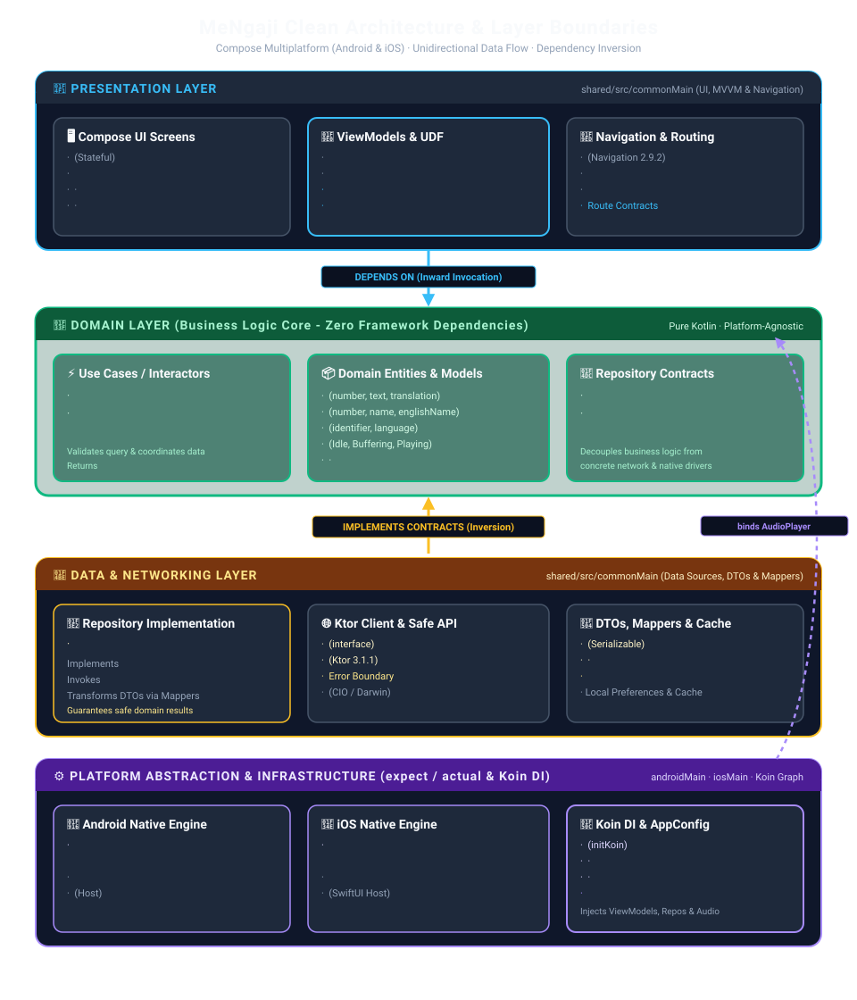
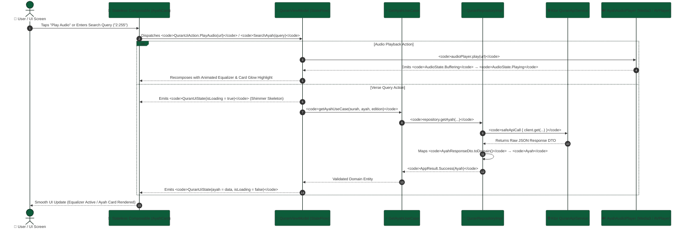

<div align="center">

<p align="center">
  
</p>

# 🌙 MeNgaji (مِعْنَاقَاجِي)
### *Modern, Elegant, and Fast Cross-Platform Islamic Companion*

[](https://kotlinlang.org)
[](https://www.jetbrains.com/lp/compose-multiplatform/)
[](https://github.com/prayogizan/Me-Ngaji)
[](#-architecture--system-design)
[-D4AF37.svg?style=for-the-badge)](gradle/libs.versions.toml)
[](LICENSE)

<br/>

**MeNgaji** is an open-source, modern, cross-platform Islamic mobile application built from the ground up using **Compose Multiplatform (CMP)** targeting **Android** and **iOS** from a single shared Kotlin codebase. It delivers an elegant Quran reading experience, high-fidelity audio recitation streaming, and Islamic lifestyle tools wrapped in a bespoke **Emerald & Gold** Material 3 design system.

</div>

---

## 📑 Table of Contents
- [✨ Key Features](#-key-features)
- [🏛️ Architecture & System Design](#️-architecture--system-design)
  - [System Architecture Diagram](#-1-system-architecture-diagram)
  - [Unidirectional Data Flow (UDF) Loop](#-2-unidirectional-data-flow-udf--reactive-state-machine)
  - [Core Architectural Pillars](#️-3-core-architectural-pillars)
- [🛠️ Technology Stack](#️-technology-stack)
- [📁 Project Directory Structure](#-project-directory-structure)
- [🚀 Getting Started](#-getting-started)
  - [Prerequisites](#prerequisites)
  - [Clone & Setup](#clone--setup)
  - [Running on Android](#running-on-android)
  - [Running on iOS](#running-on-ios)
- [⚙️ Build Flavors & Environments](#️-build-flavors--environments)
- [🧪 Testing & Quality Assurance](#-testing--quality-assurance)
- [📚 Engineering Documentation](#-engineering-documentation)
- [📄 License & Authors](#-license--authors)

---

## ✨ Key Features

### 📖 1. Al-Quran Reader & Deep Search Engine
* **Instant Verse Lookup:** Seamlessly look up any verse using `Surah:Ayah` notation (e.g., `2:255` for *Ayat Al-Kursi*, `112:1` for *Surah Al-Ikhlas*) or global verse indices (`1` to `6236`).
* **Multi-Edition Aggregation:** Fetches and synchronizes multiple editions in a single unified flow:
  * **Arabic Text:** Native Quranic Uthmani script.
  * **Indonesian Translation:** *Kementerian Agama Republik Indonesia (Kemenag)*.
  * **English Translation:** *Sahih International*.
  * **Audio Recitation:** *Sheikh Mishary Rashid Alafasy*.
* **Native RTL Typography:** Authentic Arabic typography rendered via Google Fonts **Amiri** font family with bidirectional RTL/LTR text support.
* **Smart Suggestion Chips:** One-tap quick chips for popular and frequently recited Ayahs.

### 🔊 2. Cross-Platform Audio Recitation Streaming Engine
* **Platform-Native Audio Drivers:** Abstracted behind Kotlin `expect/actual` declarations and injected seamlessly via Koin DI:
  * **Android:** Powered by **AndroidX Media3 (ExoPlayer 1.5.1)** with lifecycle and state listener hooks.
  * **iOS:** Powered by Apple **AVFoundation (`AVPlayer`)** configured with `AVAudioSessionCategoryPlayback` for background audio playback.
* **Reactive Audio Lifecycle (`AudioState`):** Unidirectional state flow tracking `Idle`, `Buffering`, `Playing`, `Paused`, and `Error(message)`.
* **Interactive Ayah Audio Controls:**
  * Real-time animated **4-bar Equalizer Visualizer** during active playback.
  * Indeterminate **Circular Buffering Indicator**.
  * Dynamic Play, Pause, Resume, and Stop buttons with smooth `AnimatedContent` transitions.
* **Active Card Visual Feedback:** Animated glowing emerald/gold border highlights and elevation boost on the currently playing `AyahCard`.
* **Lifecycle Auto-Stop Guard:** Automatically halts playback when navigating between tabs, executing new searches, or leaving the screen.

### 🕌 3. Daily Shalat Schedule & Roadmap
* **Islamic Skyline Hero Banner:** Custom elevated vector illustration header with primary container styling.
* **Feature Roadmap Cards:** Interactive previews of upcoming Islamic lifestyle features:
  1. *Location-Based Prayer Times*
  2. *Qibla Compass Direction*
  3. *Customizable Adhan Notifications*
* **Interactive "Notify Me" CTA:** Floating call-to-action button with instant snackbar confirmation feedback.

### ⚙️ 4. Build Flavors & Environment Configuration
* **Environment Separation:** Unified `AppConfig` and `AppEnvironment` models supporting `DEV` and `PROD` modes.
* **Android Product Flavors:** Configured with `dev` (`com.uncaan.mengaji.dev`) and `prod` (`com.uncaan.mengaji`) build flavors.
* **Dynamic Network Logging:** Automatically configures Ktor HTTP client logging (`LogLevel.ALL` on `DEV`, `LogLevel.INFO` on `PROD`).

### 🎨 5. Islamic Material 3 Design System
* **Curated Palette:** Rooted in Islamic **Emerald Green** (`#0D5C3A`, `#1B8253`, `#083D26`) and warm **Satin Gold** (`#D4AF37`, `#F3E5AB`).
* **Adaptive Theming:** Full support for both Light and Dark mode with high-contrast, accessible typography.
* **Resilient UI States:** Shimmer loading skeletons, animated empty search states, and error recovery states with retry buttons.

---

## 🏛️ Architecture & System Design

MeNgaji is engineered with strict adherence to **Clean Architecture**, **SOLID Principles**, and **Unidirectional Data Flow (UDF)** to ensure high scalability, platform independence, testability, and maintainability across Android and iOS.

### 📐 1. Clean Architecture Layers & Boundary Blueprint

<p align="center">
  
</p>

---

### 🔁 2. Unidirectional Data Flow (UDF) & Reactive State Machine

All user interactions in MeNgaji follow an unyielding **predictable cyclical loop** guaranteeing unidirectional state transitions and zero UI side effects.



---

### 🏛️ 3. Core Architectural Pillars

| Architectural Pillar | Implementation Rule | System Benefit |
| :--- | :--- | :--- |
| **Separation of Concerns (SoC)** | `Presentation` handles UI only; `Domain` encapsulates business rules; `Data` manages network/storage. | Eliminates cross-layer leakage and ensures isolated unit testing. |
| **Dependency Inversion (DIP)** | Presentation and Data layers depend inward on Domain abstractions (`QuranRepository`, `AudioPlayer`). | Swapping networking libraries or UI frameworks requires zero domain alterations. |
| **Platform Isolation (`expect/actual`)** | AndroidX Media3 ExoPlayer & iOS AVPlayer are hidden behind `expect class AyahAudioPlayer`. | 100% shared Kotlin UI in `commonMain` while utilizing hardware-accelerated native audio engines. |
| **Fail-Safe Network Boundary** | Every remote call is guarded by `safeApiCall { }` converting exceptions into typed `DataError.Network`. | Prevents unhandled HTTP crashes and yields user-friendly error banners with retry triggers. |
| **Immutable UDF States** | ViewModels expose read-only `StateFlow<UiState>`, mutated strictly via internal sealed `UiAction` reducers. | Guarantees deterministic state reproduction, eliminates race conditions, and prevents state desync. |

---

## 🛠️ Technology Stack

| Category | Library / Tool | Version | Purpose |
| :--- | :--- | :--- | :--- |
| **Language** | [Kotlin Multiplatform](https://kotlinlang.org/) | `2.4.10` | Shared business logic, models, networking, and UI |
| **UI Framework** | [Compose Multiplatform](https://www.jetbrains.com/lp/compose-multiplatform/) | `1.11.1` | Declarative cross-platform UI for Android & iOS |
| **Design System** | [Material 3](https://m3.material.io/) | `1.11.0-alpha07` | Dynamic color theming, adaptive components, and animations |
| **DI** | [Koin Multiplatform](https://insert-koin.io/) | `4.0.2` | Dependency Injection (`koin-core`, `koin-compose-viewmodel`) |
| **Networking** | [Ktor Client](https://ktor.io/) | `3.1.1` | Async HTTP client (CIO engine on Android, Darwin on iOS) |
| **Serialization** | [`kotlinx.serialization`](https://github.com/Kotlin/kotlinx.serialization) | `1.8.0` | JSON parsing and type-safe `@Serializable` navigation |
| **Concurrency** | [`kotlinx.coroutines`](https://github.com/Kotlin/kotlinx.coroutines) | `1.10.1` | Asynchronous coroutines, `StateFlow`, and reactive streams |
| **Navigation** | [Navigation Compose](https://developer.android.com/guide/navigation) | `2.9.2` | Type-safe multiplatform route transitions and tab bar |
| **Android Audio** | [AndroidX Media3](https://developer.android.com/media/media3) | `1.5.1` | High-performance ExoPlayer audio stream manager |
| **iOS Audio** | [AVFoundation](https://developer.apple.com/documentation/avfoundation) | Native | Apple `AVPlayer` with background audio session |
| **Build System** | [Gradle Version Catalog](https://docs.gradle.org/current/userguide/platforms.html) | `9.0.1` | Centralized dependency management (`libs.versions.toml`) |

---

## 📁 Project Directory Structure

```
MeNgaji/
├── androidApp/                                  # Android Application module
│   ├── src/main/
│   │   ├── AndroidManifest.xml                  # Manifest with Internet permissions
│   │   ├── java/com/uncaan/mengaji/
│   │   │   └── MainActivity.kt                  # Android Activity host & AppConfig setup
│   │   └── res/                                 # Adaptive launcher mipmaps & icons
│   └── build.gradle.kts                         # Android build config & product flavors (dev, prod)
├── iosApp/                                      # iOS Application module
│   ├── iosApp/
│   │   ├── iOSApp.swift                         # SwiftUI entry point
│   │   └── ContentView.swift                    # Compose UI view controller wrapper
│   └── iosApp.xcodeproj                         # Xcode project configuration
├── shared/                                      # Shared Kotlin Multiplatform module
│   ├── src/
│   │   ├── commonMain/                          # Cross-platform shared source
│   │   │   ├── composeResources/                # Vector drawables, Amiri font, strings
│   │   │   └── kotlin/com/uncaan/mengaji/
│   │   │       ├── App.kt                       # Main App composable, Scaffold & NavHost
│   │   │       ├── core/                        # Core foundational components
│   │   │       │   ├── audio/                   # AudioPlayer interface & AudioState
│   │   │       │   ├── config/                  # AppConfig & AppEnvironment models
│   │   │       │   ├── data/network/            # Ktor HttpClientFactory & SafeApiCall
│   │   │       │   ├── domain/model/            # AppResult & DataError domain types
│   │   │       │   └── di/                      # CoreModule & KoinInit entry point
│   │   │       ├── feature/                     # Domain features
│   │   │       │   ├── quran/                   # Al-Quran reader feature (Data, Domain, Presentation)
│   │   │       │   └── shalat/                  # Daily Shalat schedule roadmap feature
│   │   │       ├── navigation/                  # Type-safe routes & MeNgajiBottomBar
│   │   │       └── theme/                       # Material 3 Theme, Color, Typography
│   │   ├── androidMain/                         # Android-specific actuals
│   │   │   └── kotlin/com/uncaan/mengaji/
│   │   │       ├── core/audio/                  # AyahAudioPlayer.android.kt (Media3 ExoPlayer)
│   │   │       └── core/di/                     # PlatformModule.android.kt
│   │   ├── iosMain/                             # iOS-specific actuals
│   │   │   └── kotlin/com/uncaan/mengaji/
│   │   │       ├── core/audio/                  # AyahAudioPlayer.ios.kt (AVFoundation AVPlayer)
│   │   │       └── core/di/                     # PlatformModule.ios.kt
│   │   └── commonTest/                          # Shared Unit Test Suite
│   │       └── kotlin/com/uncaan/mengaji/       # QuranViewModelTest, AudioStateTest, etc.
│   └── build.gradle.kts                         # Shared KMP build dependencies & targets
├── engineer-docs/                               # System architecture contracts & guides
├── gradle/                                      # Gradle Wrapper & libs.versions.toml
└── mengaji_app_logo.svg                         # High-res vector app logo
```

---

## 🚀 Getting Started

### Prerequisites
* **Java Development Kit (JDK):** Version 17 or 21 (Temurin or Azul recommended).
* **Android Studio:** Ladybug (2024.2+) or newer with the **Kotlin Multiplatform Mobile** plugin.
* **Android SDK:** Compile SDK `36`, Minimum SDK `24`.
* **Xcode (for iOS build):** Version 15.0+ on macOS.

### Clone & Setup
```bash
git clone https://github.com/prayogizan/Me-Ngaji.git
cd Me-Ngaji
```

### Running on Android
Select your active build variant in Android Studio (`devDebug` recommended for local development), or run via Gradle CLI:

```bash
# Build and install Development Debug APK (com.uncaan.mengaji.dev)
./gradlew :androidApp:installDevDebug

# Assemble Production Release APK (com.uncaan.mengaji)
./gradlew :androidApp:assembleProdRelease
```

### Running on iOS
1. Open the iOS project in Xcode:
   ```bash
   open iosApp/iosApp.xcodeproj
   ```
2. Select your target simulator (e.g. `iPhone 16 Pro`) or physical device and press **Run** (`⌘ + R`).

---

## ⚙️ Build Flavors & Environments

| Environment | Android Product Flavor | Android App ID | iOS Bundle Identifier | Ktor Log Level |
| :--- | :--- | :--- | :--- | :--- |
| **Development (`DEV`)** | `dev` | `com.uncaan.mengaji.dev` | `com.uncaan.mengaji.dev` | `LogLevel.ALL` (Verbose) |
| **Production (`PROD`)** | `prod` | `com.uncaan.mengaji` | `com.uncaan.mengaji` | `LogLevel.INFO` (Muted) |

---

## 🧪 Testing & Quality Assurance

MeNgaji enforces rigorous unit and integration testing across all Clean Architecture layers:

```bash
# Run all unit tests across the shared module
./gradlew :shared:testAndroidHostTest

# Run all project test suites
./gradlew test

# Run full project linting and quality checks
./gradlew check
```

### Testing Strategy Highlights:
* **Network Mocking:** Tests in `shared/commonTest` utilize Ktor `MockEngine` to simulate HTTP responses and verify error boundary handling without hitting live endpoints.
* **Coroutines Dispatcher:** ViewModels are verified with `StandardTestDispatcher` and `advanceUntilIdle()` to ensure predictable StateFlow emissions.
* **Audio Fakes:** Core audio playback actions are verified using `FakeAudioPlayer` mocks.

---

## 📚 Engineering Documentation

Comprehensive architecture specifications, layer contracts, and coding standards are maintained in the repository:
* 📖 [Architecture Overview & Engineering Standards](engineer-docs/architecture-overview.md)

---

## 📄 License & Authors

This project is licensed under the **MIT License** — see the [LICENSE](LICENSE) file for details.

* **Lead Architect & Developer:** [Akhmad Fauzan Prayogi](https://github.com/prayogizan) (`@prayogizan`)